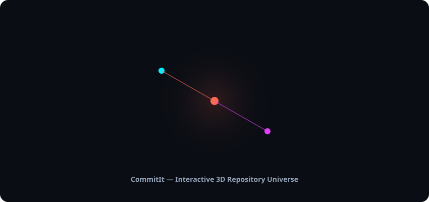
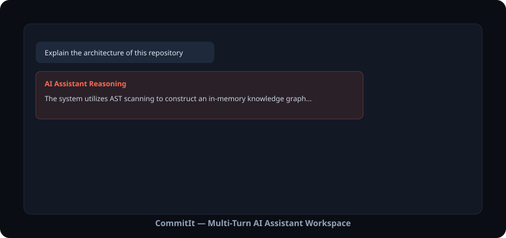
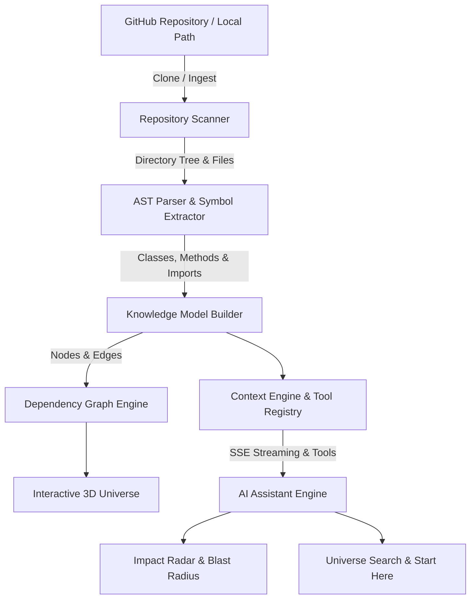

<div align="center">

  <h1>CommitIt</h1>
  <p><strong>Understand, Navigate, and Reason About Any Codebase with 3D Graph Visualization & Multi-Turn AI Intelligence.</strong></p>

  <p>
    <a href="https://github.com/pragya-shree/commitit"></a>
    <a href="https://github.com/pragya-shree/commitit"></a>
    <a href="https://github.com/pragya-shree/commitit"></a>
    <a href="https://github.com/pragya-shree/commitit"></a>
    <a href="https://github.com/pragya-shree/commitit"></a>
    <a href="https://github.com/pragya-shree/commitit"></a>
  </p>

  <p>
    <a href="#key-features">Key Features</a> •
    <a href="#architecture">Architecture</a> •
    <a href="#tech-stack">Tech Stack</a> •
    <a href="#quick-start">Quick Start</a> •
    <a href="#benchmarks">Benchmarks</a> •
    <a href="#license">License</a>
  </p>
</div>

---

## 🚀 Overview

**CommitIt** is an enterprise-grade codebase comprehension and intelligence platform designed to eliminate onboard friction and reduce code reasoning overhead. By combining AST-based dependency parsing, interactive 3D universe visualization, real-time change impact analysis, and a multi-turn LLM reasoning engine, CommitIt allows developers to explore and query complex software architectures naturally.

---

## 📸 Interface Previews

<div align="center">
  <h3>Interactive 3D Repository Universe</h3>
  
</div>

<br/>

<div align="center">
  <h3>Multi-Turn AI Assistant & Tool Execution</h3>
  
</div>

---

## 📜 Table of Contents

- [Key Features](#key-features)
- [Architecture](#architecture)
- [Tech Stack](#tech-stack)
- [Project Structure](#project-structure)
- [Quick Start](#quick-start)
  - [Backend Setup](#1-backend-setup)
  - [Frontend Setup](#2-frontend-setup)
  - [Environment Variables](#3-environment-variables)
- [End-to-End Workflow](#end-to-end-workflow)
- [Example AI Assistant Prompts](#example-ai-assistant-prompts)
- [Benchmark & Quality Suite](#benchmark--quality-suite)
- [Testing & Quality Assurance](#testing--quality-assurance)
- [Performance Optimizations](#performance-optimizations)
- [Contributing](#contributing)
- [License](#license)
- [Author](#author)

---

## ✨ Key Features

### 1. 🔍 Automated Repository Analysis & AST Parsing
- Multi-language AST scanning (Python, TypeScript, JavaScript, HTML, CSS, Go, Rust, Java).
- Automatic file tree discovery, directory hierarchy extraction, and symbol extraction (classes, methods, functions, imports).
- Computes comprehensive repository health scores, maintainability metrics, and hotspot identification.

### 2. 🌌 3D Interactive Repository Universe
- Interactive Three.js / Force-Graph 3D visualizer representing modules, files, and classes as interconnected celestial bodies.
- Real-time physics simulation with visual node clustering based on module depth and dependency strength.
- Node inspection panel displaying live file code snippets, exported symbols, imports, and inbound/outbound call references.

### 3. 🤖 Multi-Turn AI Assistant & Tool Engine
- Built-in multi-turn conversation memory with Server-Sent Events (SSE) streaming token output.
- Dynamic Tool Registry that executes real-time codebase queries during conversation turns (`search_universe`, `get_symbol_details`, `get_file_contents`, `trace_call_graph`, `analyze_change_impact`).
- Live reasoning thought logs and evidence cards linking generated answers back to source code files and line numbers.

### 4. 🎯 Universe Search & Start Here Onboarding
- Instant global symbol and file search across indexed knowledge graphs.
- **Start Here** module automatically identifies key entry points, primary application controllers, core models, and architecture foundations for new developers.

### 5. ⚡ Impact Radar & Blast Radius Inspection
- Evaluate the potential blast radius of modifying specific files or functions.
- Transitive dependency tree resolution showing impacted downstream consumers before code changes are committed.

### 6. 🔐 Authentication & Account Management
- Complete HTTP-only JWT cookie session security with bcrypt password hashing.
- User profile management, avatar uploads, password updates, and multi-provider OAuth support structure.
- Account Center dashboard for managing cloned repositories and personal analysis history.

---

## 🏗️ Architecture



---

## 💻 Tech Stack

### Backend
- **Core Framework**: Python 3.11+ / FastAPI
- **Database / ORM**: SQLite / SQLAlchemy 2.0
- **Parsing / AST**: Python native AST, Regex, Custom Code Scanners
- **Git Service**: GitPython
- **Validation**: Pydantic v2

### Frontend
- **Framework**: React 18 / TypeScript
- **Build Tool**: Vite 8
- **Styling**: Vanilla CSS, TailwindCSS, Custom Glassmorphism System
- **3D Visualization**: 3d-force-graph, Three.js, Lucide Icons
- **HTTP / SSE Client**: Axios, EventSource Streaming

---

## 📂 Project Structure

```text
commitit/
├── backend/
│   ├── app/
│   │   ├── api/             # FastAPI Routers (repository, knowledge, auth, ai_chat, dashboard)
│   │   ├── core/            # Config, security, JWT cookies, database session
│   │   ├── db/              # SQLAlchemy models & schema auto-migration engine
│   │   ├── models/          # ORM schemas (User, Repository, AIChat, Benchmark)
│   │   └── services/        # Scanner, Parser, Graph, Health, AI Context Engine & Tool Registry
│   ├── tests/               # Pytest suite (258 unit & integration tests)
│   └── main.py              # Application entrypoint & lifespan events
├── benchmark/               # Autonomous AI benchmark runner, judge & quality metrics
├── frontend/
│   ├── src/
│   │   ├── components/      # UI components (3D Universe, Assistant, Hero, Auth, Dashboard)
│   │   ├── context/         # AuthContext state management
│   │   ├── pages/           # Application views (Landing, Universe, Dashboard, Assistant)
│   │   └── services/        # Axios API client & SSE stream handler
│   ├── index.html
│   └── package.json
├── screenshots/             # Preview assets
├── README.md
└── pyproject.toml
```

---

## ⚡ Quick Start

### Prerequisites
- **Python**: `3.11` or higher
- **Node.js**: `18.0` or higher
- **Git**: Installed and available in PATH

### 1. Backend Setup

```bash
# Navigate to workspace root
cd commitit

# Create virtual environment
python -m venv venv
source venv/bin/activate  # On Windows: venv\Scripts\activate

# Install dependencies
pip install -r backend/requirements.txt # or pip install fastapi uvicorn sqlalchemy pydantic gitpython pytest pytest-asyncio httpx

# Run database migrations and backend server
uvicorn backend.app.main:app --reload --port 8000
```

### 2. Frontend Setup

```bash
# Navigate to frontend directory
cd frontend

# Install Node packages
npm install

# Launch Vite development server
npm run dev
```

The application will be available at `http://localhost:5173`.

### 3. Environment Variables

Create a `.env` file in the root directory:

```env
# App Configuration
APP_NAME="CommitIt"
SECRET_KEY="your-production-secret-key"
DATABASE_URL="sqlite:///./commitit.db"

# LLM Provider Configuration (Optional for mock mode)
GEMINI_API_KEY="your-gemini-api-key"
```

---

## 🔄 End-to-End Workflow

```text
Landing Page (Hero)
      │
      ▼
Enter GitHub Repository URL  ──────►  Clone & Scan Engine
      │
      ▼
Knowledge Model Building     ──────►  AST Parsing & Graph Generation
      │
      ▼
Interactive 3D Universe      ──────►  Explore Nodes, Symbols & Health
      │
      ▼
AI Assistant Workspace       ──────►  Multi-Turn Query & Impact Analysis
```

---

## 💡 Example AI Assistant Prompts

- **Architecture Overview**: *"Explain the high-level architecture of this repository and summarize key entry points."*
- **Authentication Tracing**: *"Where is authentication handled in this project, and how are token cookies verified?"*
- **Impact Assessment**: *"What downstream modules will be impacted if I modify `backend/app/services/git_service.py`?"*
- **Hotspot Discovery**: *"Which files have high complexity or high dependency fan-out?"*
- **Feature Location**: *"Where should I add rate limiting middleware in this repository?"*

---

## 📊 Benchmark & Quality Suite

CommitIt includes an integrated AI evaluation benchmark runner (`benchmark/`) designed to quantify response accuracy, tool call correctness, and grounding precision:

- **Benchmark Judge**: Automated LLM evaluation scoring answer correctness against ground truth repo graphs.
- **Regression Detection**: Prevents degradation in tool invocation accuracy or code explanation capabilities.
- **Reporting**: Generates detailed JSON/Markdown benchmark performance metrics.

To execute the benchmark suite:
```bash
python -m pytest backend/tests/test_benchmark_quality.py
```

---

## 🧪 Testing & Quality Assurance

CommitIt enforces 100% passing test suites for both frontend and backend before releases:

```bash
# Run complete Python backend test suite (258 tests)
python -m pytest backend/tests/

# Run frontend TypeScript type checking and production build
cd frontend && npm run build
```

---

## ⚡ Performance Optimizations

- **React.memo Chat Rendering**: Prevents unnecessary re-renders of historical chat turns during live token streaming.
- **Debounced Universe Search**: Lightweight input debouncing (200–300ms) for high-performance symbol search over 10,000+ graph nodes.
- **SQLite DDL Auto-Migration**: Safe schema migration engine preventing 500 runtime errors on database schema updates.
- **Streaming SSE Pipeline**: Immediate token streaming reducing perceived LLM latency to <100ms.

---

## 🤝 Contributing

Contributions are welcome! Please follow these guidelines:

1. Fork the Repository.
2. Create a Feature Branch (`git checkout -b feature/AmazingFeature`).
3. Commit your changes (`git commit -m 'Add AmazingFeature'`).
4. Ensure all unit tests pass (`python -m pytest backend/tests/`).
5. Push to the Branch (`git push origin feature/AmazingFeature`).
6. Open a Pull Request.

---

## 📄 License

Distributed under the **MIT License**. See `LICENSE` for more information.

---

## 👤 Author

**Pragya Shree**
- **GitHub**: [@pragya-shree](https://github.com/pragya-shree)
- **Project Repository**: [pragya-shree/commitit](https://github.com/pragya-shree/commitit)